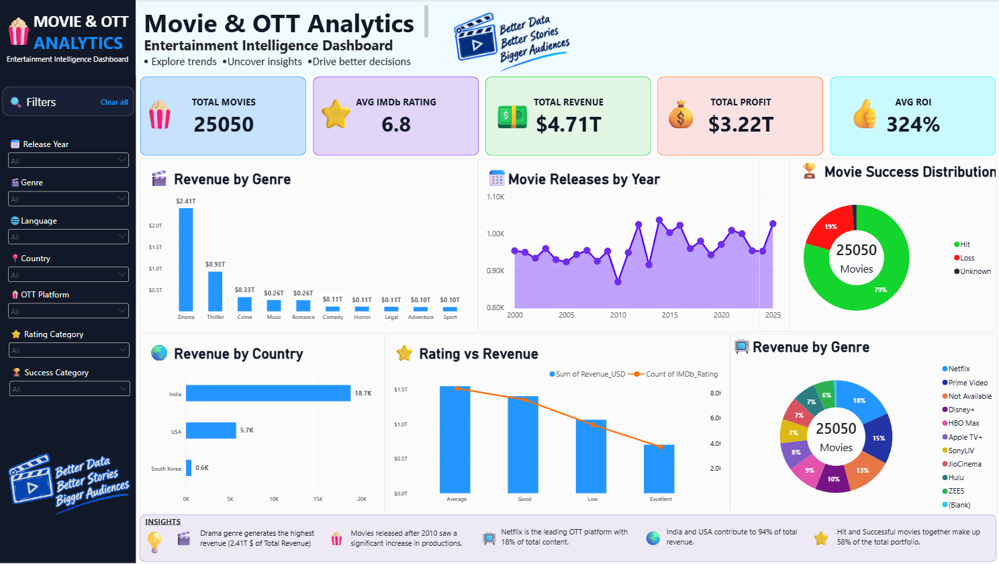

# 🎬 Movie & OTT Analytics — Entertainment Intelligence Dashboard

> An end-to-end Data Analytics and Business Intelligence project analyzing movie releases, revenue, profitability, ratings, ROI, and OTT distribution using **Microsoft Excel and Power BI**.

---

## 📊 Dashboard Preview

---

## 📌 Project Overview

The **Movie & OTT Analytics Dashboard** is an end-to-end analytics project created to transform a large movie dataset into meaningful business insights through data cleaning, exploratory analysis, DAX calculations, and interactive visualization.

The project follows a complete analytics workflow:

**Raw Data → Data Cleaning → Data Transformation → EDA → DAX → Dashboard → Business Insights**

The final Power BI dashboard allows users to explore movie performance across:

- 🎬 Movie releases
- 💰 Revenue & profitability
- ⭐ IMDb ratings
- 📈 ROI
- 🎭 Genres
- 📺 OTT platforms
- 🌍 Countries
- 🗣️ Languages
- 🎥 Directors
- 🏢 Production companies
- 🏆 Movie success categories

---

# 🎯 Project Objective

The primary objective of this project is to **demonstrate practical, job-ready Data Analytics and Business Intelligence skills** by taking a raw movie dataset through a complete analytics workflow and converting it into an interactive executive dashboard.

Through this project, I aimed to demonstrate my ability to:

- 🧹 Clean and validate a large dataset
- 🔄 Transform and prepare data for analysis
- 📊 Perform Exploratory Data Analysis (EDA)
- 📈 Identify trends and patterns
- 🧮 Create analytical calculations and KPIs using DAX
- 📉 Build meaningful Power BI visualizations
- 🎛️ Create interactive dashboard filters
- 💰 Analyze revenue, profit, and ROI
- ⭐ Analyze movie ratings and performance
- 📺 Analyze OTT platform distribution
- 🌍 Perform country and language-based analysis
- 💡 Convert data into meaningful business insights
- 🎨 Design a professional executive dashboard
- 📁 Document and present an analytics project professionally on GitHub

### Portfolio Goal

This project is primarily designed to **showcase my practical Data Analytics skills**, rather than simply demonstrate a dashboard.

---

# 🗂️ Dataset

The analytical dataset contains approximately **25,050 movie records** with 25+ fields covering movie information, financial metrics, ratings, popularity, OTT availability, and derived analytical categories.

### Major Dataset Fields

| Category | Fields |
|---|---|
| Movie Information | Movie_ID, Title, Release_Date, Release_Year |
| Classification | Genre, Sub_Genre, Language, Country |
| People & Companies | Director, Production_Company |
| Financial | Budget_USD, Revenue_USD, Profit_USD, ROI_% |
| Ratings | IMDb_Rating, User_Rating |
| Popularity | Vote_Count, Popularity_Score |
| OTT | OTT_Platform, OTT_Available, OTT_Release_Date |
| Content | Content_Type, Age_Rating |
| Franchise | Franchise, Sequel |
| Awards | Awards_Count |
| Derived Fields | Rating_Category, Revenue_Category, Budget_Category, Success_Category |

### ⚠️ Dataset Disclaimer

Movie titles, directors, production companies, languages, countries, and genres are based on real-world movie entities.

However, some **financial, ratings, popularity, vote, OTT, and selected award-related values are simulated/analytical values created for this portfolio project**.

Therefore, dashboard findings should be interpreted as insights from this analytical dataset and **not as verified real-world industry statistics**.

---

# 🧹 Data Cleaning & Preparation

The raw dataset was prepared before performing analysis and visualization.

### Cleaning Activities

- Removed duplicate records
- Checked missing values
- Validated ratings
- Validated runtime values
- Standardized text fields
- Cleaned language and country values
- Cleaned director and production company fields
- Handled missing financial values
- Created missing-data flags
- Created calculated analytical columns
- Converted the dataset into an Excel Table
- Prepared the cleaned dataset for Power BI

### Missing Value Strategy

Missing financial values such as Budget and Revenue were **kept blank instead of replacing them with zero**.

This prevents missing financial information from being incorrectly interpreted as zero revenue or zero budget.

Categorical missing values were handled using appropriate project-defined categories such as:

- `Unknown`
- `Not Available`
- `Standalone`

---

# 📊 Exploratory Data Analysis

EDA was performed using **Microsoft Excel**, primarily through PivotTables and analytical summaries.

### Analysis Performed

- Revenue by Genre
- Revenue by OTT Platform
- Revenue by Language
- Revenue by Country
- Movie Releases by Year
- Director Performance
- Production Company Performance
- Rating Category Analysis
- Budget Category Analysis
- Movie Success Distribution

---

# 📈 Power BI Dashboard

The final dashboard was designed as an **Executive Entertainment Intelligence Dashboard**.

### Key KPIs

- 🎬 Total Movies
- ⭐ Average IMDb Rating
- 💰 Total Revenue
- 📈 Total Profit
- 🔄 Average ROI

### Interactive Filters

The dashboard includes interactive filters that allow users to explore the dataset by dimensions such as:

- Release Year
- Genre
- Country
- OTT Platform
- Rating Category
